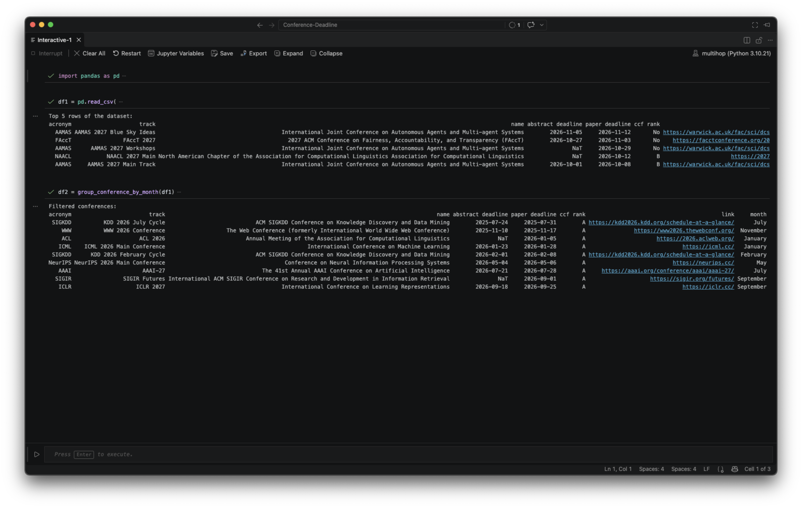
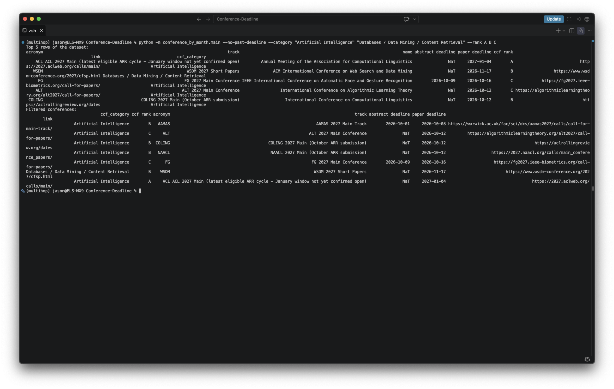

# Use case

Use Agent to get list of conferences and journals abstract and paper submission deadline in specific research category.

The list of conferences and journals follow China Computer Federation (CCF)'s category and rank.

See the list of conferences/journals listed by CCF
```bash
python -m ccf_catalog.main --category="Artificial Intelligence" --rank A
```

See the list of conferences/journals recorded locally
```bash
python -m conference_by_motn.main --no-past-deadline \
  --rank=A
```

# Folder Structure

```
├── data
├── project_common
├── ccf_catalog
├── conference_by_month
```

# Output

Use in Python Interactive Window:



Use in Terminal:

